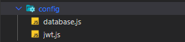
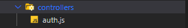
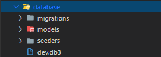
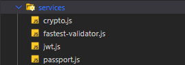

# wabisque-express-api-server-template

## Overview

This project is an API template made with express for full stack web developer who want to build both frontend and backend with JavaScript. 

### Initializing the Project

This project requires that you have already installed node and have NPM (Node Package Manager) working.

* To start this project, you’d first have to clone this projects repository using the link below  
[clone the project](https://github.com/wabisque/wabisque-express-api-server-template.git),  
or download the project files using the link below  
[download project as zip](https://github.com/wabisque/wabisque-express-api-server-template/archive/main.zip).
* Open the project folder in an IDE (Integrated Development Environment) of your choosing – I personally use `Visual Studio Code`.
* Open the integrated terminal of the IDE or any other terminal of your choosing, navigate to the project folder’s directory and type in the command below – the working directory of the integrated terminal would be automatically set to the root directory of the project.  
All dependencies of the project would be install – to see all the dependencies of the project, open the `package.json` file at the root folder of the project. Furthermore, note that this step is interchangeable with the previous.

```
npm i
```

* The project is finally setup. You can run the following command in your terminal to start the server.

```
npm run dev
```

### Project Layout

The project has only one file, `index.js` which is located at its root folder. The contents of are structured in a readable manner with comments to show what each line of code does. You’ll, in most cases not alter the contents of this file, except for cases where you’d want to initialize a new service \[more on services later\], or cases where you’d like to remove or comment out development lines. Anyway, without further ado, I’ll discuss the contents of the `index.js` file.

* The first section of the `index.js` file are the import statements. This is what these statements look like:

```js
const dotenv = require('dotenv');
const express = require('express');

// start:: Dev tools - These lines of code would be removed during production.
const morgan = require('morgan');
// end:: Dev tools

const jwtService = require('./app/services/jwt');
const passportService = require('./app/services/passport');

const coreMiddleware = require('./app/middleware/core');
const errorMiddleware = require('./app/middleware/error');

const routes = require('./app/routes');
```

If you look closely, you’d be able to find some development lines – lines of code that should be removed during production.

* The second section is the setup section. It is where we setup ENV variables \[more on ENV variables later\], the server, and services. This is what is looks like:

```js
// setup the .env file's variables to be accessed through `process.env`/
dotenv.config();

// creation of the express server app.
const app = express();

// start:: Dev tools - These lines of code would be removed during production.
app.use(morgan('dev'))
// end:: Dev tools

// initialization for services
jwtService.initialize();
passportService.initialize(app);
```

Again, there are some development lines of code in this section.

* The third section is the registration section. It is where the core and error middleware \[more on middleware later\], as well as, routes \[more on routes later\] are registered. This is what this section looks like:

```js
// registration for core middleware.
coreMiddleware(app);

// registration for routes.
routes(app);

//registration for error middleware
errorMiddleware(app);
```

* The final section of the “index.js” file is the initialization of the server. This is the section where the server is started or ran. This is what is looks like:

```js
// initialization of the express server app.
app.listen(process.env.SERVER_PORT, function (error) {
  if(error) return console.log('ERROR', error);

  console.log('\x1b[0m %s\x1b[36m %s\x1b[0m','\n *** server running on', `http://localhost:${process.env.SERVER_PORT}`, '***\n')
});
```

With the “index.js” file out of the way, let’s try and understand the other files that back it up. I’ve gathered those files into various folders that exist in the “app” folder. The image below demonstrates how the “app” folder is structured:


I’d be giving a brief summary of purpose for each of the folders in the `app` folder:

*	**config** – Holds various config files that are relied upon by several functions of the app.
*	**controllers** – Holds all controller that are used to control the behavior of requests made to routes specified in the `routes` folder.
*	**database** – Holds all database related files – migrations, models, seeders and development SQLite databases.
*	**keys** – Holds all sha512 keys for JWT verification.
*	**middleware** – Holds all middleware needed for request checks.
*	**routes** – Holds all files that specify the routes by which the server can be consumed.
*	**services** – Holds all functionalities created using unrelated dependencies.

### Starting Dependencies of the Project

This project come with a list of starting dependencies installable through NPM. This, however, doesn’t imply that you can use your own dependencies – bear in mind that this project is a template; its is made to be built upon. Here is the list of starting dependencies and what they do in no particular order:

*	**cors** – This helps protect the server from request made from untrusted sources.
*	**crypto** – This helps generate hashes for raw text and also verify those generated hashes against text. This is very useful for hashing passwords.
*	**dotenv** – This allows us to use variables specified in a `.env` file at the root folder of the project in any other JavaScript file through the globally available `process.env` object.
*	**express** – This is what the server is built with.
*	**fastest-validator** – This provides functionality for validating request data. I created a service using this dependency specifically for validating the body of any request – similar to `$request→validate` in the Laravel framework.
*	**jsonwebtoken** – This helps generate and verify JWTs (Json Web Tokens). This is very useful for JWT authentication.
*	**moment** – This provides functionality for working with date and time values.
*	**passport** – This allows us to authenticate users.
*	**passport-jwt** – This is used by the `passport` dependency to allow us to authenticate users using JWTs.
*	**sequelize** – This is an ORM (Object Relational Mapper) for databases. It is similar to `eloquent` in the Laravel framework.

The following dependencies are only useful in the development stage and would be taken out at the production stage:

*	**morgan** – This allow us to log HTTP (Hypertext Transfer Protocol) request and response to the console or the working terminal.
*	**nodemon** – This allows us to automatically restart the server if running when there has been a change in the files of the project.
*	**sqlite3** – This allows us to create `sqlite3` connections using the `sequelize` dependency.
*	**sequelize-cli** – This allows us to create database migrations, models, and seeders using the terminal. It behaves like `artisan` in the Laravel framework.

## ENV Variables

ENV or `environment` variables are variable needed by the current project environment – which could be `development`, `testing` or `production` to run. All ENV variables are declared and used manually, meaning, you can create your very own ENV variables. To use any ENV variables, you’d need to install the `dotenv` package – not to worry, this dependency should be already installed by this point. The following are steps you can take to create and use your own ENV variables, assuming the `dotenv` dependency is already installed:

* Create a `.env` file at the root folder of the project as demonstrated by the image below.


* Declare your ENV variable – for this example our variable is going to be `DEV_AGE`. Please note that ENV variables should be declared in uppercase snake-case. The image below demonstrates this step.

```
DEV_AGE=21
```

* Import the `dotenv` dependency into the target file, configure the `dotenv` file by calling its `config` method, and access your variable through `process.env`. The image below demonstrates this step – I’ll log the value of our ENV variable to the console.

```js
const dotenv = require('dotenv');

dotenv.config();

console.log('The value of my ENV variable is:', process.env.DEV_AGE);
```

Below is the result when the target file is run.

```
The value of my ENV variable is: 21
```

There is a `.env.example` file in the root folder of the project which you must copy as a basis for a `.env` file in none exists. The contents of the `.env.example` file are as follows.

```
NODE_ENV=development

DB_DIALECT=mysql
DB_HOST=localhost
DB_USER=root
DB_PASSWORD=
DB_DATABASE=my_db

SERVER_PORT=8181
```

And their uses are as follows:

* **NODE_ENV**: Specifies what environment the app should be running in. Change its value to `production` upon deployment of the server, and to `testing` upon testing the server.
*	**All DB_ variables**: All ENV variables prefixed with `DB_` are credentials needed for a database connection.
     * **DIALECT**: The type of database in use – examples could be SQLite, MySQL, Postgres and the likes.
    *	**HOST**: The host URL of the database server.
    *	**USER**: The username of the user trying to access the database server.
    *	**PASSWORD**: The password of the user trying to access the database server.
    *	**DATABASE**: The database to be utilized by the server.
*	**SERVER_PORT**: The port number at which the server listens to requests. Leave this variable blank if you’d like to use the default port number.

## The Config Folder

Config files hold configuration data needed by functions and “services” of the server to operate. All config files are stored in the “app/config” folder. Here’s a look into the “app/config” folder upon freshly downloading this project:



* The `database.js` file holds data for creating database connections in the various environment stages – development, testing and production. I’d urge you to refrain from changing the value of any variable which has an ENV variable assigned to it – change the ENV variable rather.
* The `jwt.js` file hold the expiry time for JWTs.

## The Controllers Folder

Controllers are files that specify the behavior of routes created in the files contained in the `app/routes` folder. All controllers should be put in the `app/controllers` folder. At default, the `app/controllers` folder should look like the image below.



You can, however, create your own controllers. Note that, in doing so, you’d have to adhere to the following rules:

*	Controller files should export an object whose values are all functions.
*	The functions in the object exported by the controller file should all return an array of functions which all take 3 arguments – req, res and next. These arguments could be called whatever you like.

A sample controller should look like the image below:

```js
function check() {
  function step1(req, res, next) {
    /**
     * Native JavaScript code
     */
  }

  function step2(req, res, next) {
    /**
     * Native JavaScript code
     */
  }

  return [
    step1,
    step2
  ]
}

module.exports = {
  check
}
```

## The Database Folder

The `app/database` folder holds all database related files. It has 3 folders – `migrations`, `models` and `seeders` – and may have development SQLite databases as shown in the image below.



I’d like to talk about the `sequelize` an the `sequelize-cli` dependencies before moving on, as they’re key to all database related functions. I’d also urge you to visit [the sequelize documentation](https://sequelize.org) for more details. As you know by now, sequelize is an ORM similar to eloquent in the Laravel framework; sequelize-cli provides cli functions as artisan does in the Laravel framework. In short, sequelize creates database connections and sequelize-cli creates migrations, models and seeders. Please read the sequelize documentation.

## The Middleware Folder

The `app/middleware` folder contains all middleware needed to process requests. There are three subfolders in the `app/middleware` folder and they are:

*	**core** – supplies functionality needed prior to handling route requests through controllers
*	**error** – supplies functionality for handling errors resulting from handling requests.
*	**guard** – guards route request as specifically defined.

The `error` and `core` subfolders, in most cases, shall remain untouched; however, new `guard` middleware files can be created according to your specifications. There are two existing guard middleware:

*	**check-auth** – which checks if a valid JWT was supply by the request. It works as an authentication guard. This functionality is powered by the `passport` and `passport-jwt` dependencies.
*	**check-roles** – which checks if the user associated with the provided JWT has specified role or roles.

You can use `guard` middleware in controller functions by calling them and spreading their results in to the return array as demonstrated in the image below.

```js
const checkAuthGuardMiddleware = require('../middleware/guards/check-auth');

function check() {
  function step1(req, res, next) {
    /**
     * Native JavaScript code
     */
  }

  function step2(req, res, next) {
    /**
     * Native JavaScript code
     */
  }

  return [
    ...checkAuthGuardMiddleware(),
    step1,
    step2
  ]
}
```

Lastly, the specification for creating a `guard` middleware is the same as creating a controller function. The only difference is that, guard middleware files export a function instead of an object.

## The Routes Folder

The `app/routes` folder contains files that specify routes by which the server can be consumed. By default, there is only one route file – `auth.js`, the `index.js` file helps to gather all routes from individual route files and register them. You can create you own route files using the `auth.js` file as a guide. Bear in mind that all routes created in a specific route file would be prefixed by that the string `api/` and file’s name – this implies that a route `/name/place` in a file `area.js` would be registered as `api/area/name/place`. If you’re too lazy to look, here’s what the `auth.js` route file looks like.

```js
const express = require('express');

const authController = require('../controllers/auth');

const router = express.Router();

router
  .route('/login')
  .post(...authController.login());

router
  .route('/logout')
  .get(...authController.logout());

router
  .route('/register')
  .post(...authController.register());

router
  .route('/user')
  .get(...authController.user());

router
  .route('/refresh')
  .post(...authController.refresh());

module.exports = router
```

NB: you can chain multiple methods to one route like this:

```js
router.
  .route('/my-route')
  .get(/** JavaScript functions. */)
  .post(/** JavaScript functions. */)
  .delete(/** JavaScript functions. */);
```

## The Services Folder

The `app/services` folder contains files that provide useful functionality using specified dependencies. By default, the `app/services` folder looks like this:



Below is a list of the functions provided by the services files in the image above:

*	**crypt.js** – provides functions for hashing strings and check strings against hashes.
*	**fastest-validator.js** – provides functions for validating JavaScript objects.
*	**jwt.js** – provides functions for generating and validating JWTs.
*	**passport.js** – provides function for checking authentication using JWTs.

You can create you own service for any dependency of your choosing.
